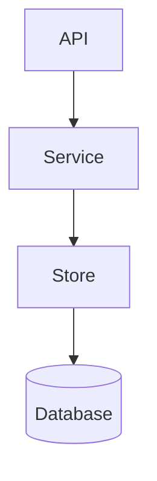

# Simple Rust Identity Service

I wanted to learn how to build a simple yet non-trivial API service in Rust, so this repo contains the code for a simple local-account identity service. It is built using the following frameworks and libraries:

- [tokio](https://docs.rs/tokio/latest/tokio/) for the async runtime
- [axum](https://docs.rs/axum/latest/axum/) and [tower](https://docs.rs/tower/latest/tower/) for the web framework
- [sqlx](https://docs.rs/sqlx/latest/sqlx/) for database access 
- [postgres](https://hub.docker.com/_/postgres) for the runtime database, and [dashmap](https://docs.rs/dashmap/latest/dashmap/) for the test fake
- [argon2](https://docs.rs/argon2/latest/argon2/) for password hashing
- [thiserror](https://docs.rs/thiserror/latest/thiserror/) for error types
- [chrono](https://docs.rs/chrono/latest/chrono/) for timestampts
- [axum-test](https://docs.rs/axum-test/latest/axum_test/) for easier API testing

This service is fully-functional, but for educational purposes only, so it shouldn't be used in a production system without a security review and more testing.

## APIs

The service implements the following APIs:

| Method | Path | Description | Request Body | Response Body
|--------|------|-------------|--------------|--------------
| POST | /accounts | Creates a new local account | [NewAccountRequest](./src/api/models.rs) | [AccountResponse](./src/api/models.rs) or BAD_REQUEST error
| POST | /sessions | Authenticates provided credentials | [AuthenticationRequest](./src/api/models.rs) | [AccountResponse](./src/api/models.rs) or BAD_REQUEST error

A caller such as an API gateway could use these APIs to support sign-up/in. During sign-in, the API gateway would use this service to authenticate the credentials, create a new digitally-signed session token, and put the account details into a cache like [redis](https://redis.io/) using the session token as the key, and drop the session token as a response cookie. Subsequent requests that include the cookie would be treated as authenticated if the token's signature is still valid.

## Architecture

The architecture and code organization I used might be a tad overkill for such a simple service, but I wanted to work out an approach that could scale up to large monoliths with several internal but isolated services, and multiple types of APIs (REST, gRPC, WebSockets, GraphQL, etc).

The architecture is divided into three layers:

Lower layers have not knowledge of the layers above them. For example, Stores have no knowledge of Services or APIs.

- **API Layer:** This is a relatively thin layer that is responsible only for the semantics of the API protocol and contract--all the real work happens in the service layer. For example, the API layer is concerned with things like JSON \[de]serialization and HTTP status codes, but not data validation, business logic, or data storage. This layer defines models for API requests and responses, but those are separate from those defined at the Service layer so that the APIs can evolve independently of the services. This layer can support multiple kinds of APIs at the same time (REST, gRPC, WebSockets, etc) each of which interacts with the same set of internal services.
- ***Service Layer:** Responsible for enforcing all the business logic and interacting with the data stores. This layer can include multiple services, but they remain isolated from each other so that services can ensure data integrity and do intelligent caching. For example, if service A wants data from service B, it must go through the public service B interface, and not directly to the service's data store.
- **Store Layer:** Responsible only for data storage and retrieval. This is a relatively thin layer that simply interacts with the database to insert, update, delete, and read data. Each service typically defines a [trait](https://doc.rust-lang.org/book/ch10-02-traits.html) for its data store, which can be implemented for different kinds of databases (e.g., PostgreSQL, MongoDB, DynamoDB, etc) as well as a fake for unit testing.
